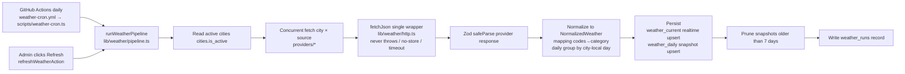
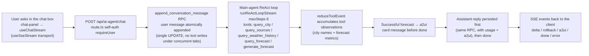
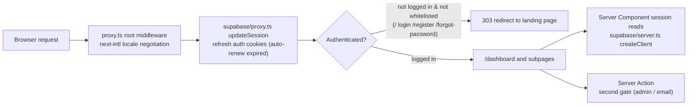

# WeatherMind — Developer Overview

A quick overview for developers. Start with the "Core Flows" diagrams to understand the implementation, then use the "Code Map" to locate the code.

## What This Is

WeatherMind is a **multi-source weather dashboard with AI day-forecast and an AI weather assistant**:

- Collects weather daily from three providers — Open-Meteo / OpenWeatherMap / WeatherAPI.com — normalizes it, and writes it to Supabase;
- The frontend shows realtime weather cards per "city × source" and the last 7 days of history;
- The core feature **ForecastAgent** produces a day forecast with a "deterministic weighted ensemble + AI plain-language interpretation": numbers first, prose second, fully reproducible;
- The **AI assistant chat** shares the same AI infrastructure as ForecastAgent, answers natural-language questions about current/historical/forecast weather, and auto-issues an a2ui metric card when an authoritative forecast is returned.

Stack: Next.js 16 (App Router) + React 19 + Tailwind 4 + shadcn/ui (on @base-ui/react) + pnpm + TS strict, light mode only.
Supabase (auth + Postgres + RLS), TanStack Query/Form, Zod, next-intl (zh default, no prefix; en at `/en`), Vitest.

## Core Flows

### 1. Weather Ingestion — where the data comes from

Two triggers share one pipeline, `runWeatherPipeline(trigger)`:

- **Scheduled**: GitHub Actions runs `scripts/weather-cron.ts` daily at 15:00 UTC (JST midnight), outside the deployed environment;
- **Manual**: the "Refresh" button on the forecast page (admin-only) → `refreshWeatherAction`.



Key points:

- **Adding a source is cheap**: implement one `ProviderAdapter` (`source` / `fetchCurrentAndForecast` / `fetchDailyHistory`) and register it in the `providers` array;
- **Failure isolation**: a failed cell counts as one error (missingKey / network / http / parse / noData / db); the run continues and never throws; terminal status success / partial / failed is written to `weather_runs`;
- **Writer side**: the service_role client (`supabase/service.ts`) bypasses RLS; manual triggers go through the admin whitelist (`lib/weather/admin.ts`).

### 2. ForecastAgent — how the day forecast is produced

**Positioning: not a general-purpose chat agent, but a "deterministic compute engine + AI interpreter" split.** All weather numbers come from a math kernel (reproducible, unit-tested, auditable); AI only translates the metrics into plain language, inside a **bounded, read-only multi-agent orchestration** — the supervisor coordinates while specialists only re-read the kernel's data (never compute), the calls stream over SSE with `temperature=0`, and the output is a pure Markdown document. The LLM can never fabricate numbers.

**Streaming pipeline** ("write-once, read-many": the first user to click "Generate" claims the row and runs the generation; everyone after just reads. The generation streams over SSE, so the user watches the reasoning and the Markdown arrive token by token):

```mermaid
flowchart LR
    U["User clicks Generate<br/>forecast-view.tsx → useForecastStream"] --> POST["POST /api/ai-agent/forecast<br/>route.ts self-auth createClient + getUser"]
    POST --> ST["runForecastAgentStream<br/>lib/forecast-agent/stream/stream.ts"]
    ST --> R["readForecast<br/>city×day×locale"]
    R -->|"success / pending"| DUP["duplicate event<br/>return as-is, no regeneration"]
    R -->|"none"| CL["claimPending<br/>unique key city×day×locale"]
    R -->|"failed"| CD["cooldown check<br/>isWithinRetryCooldown<br/>5-min ban after failure"]
    CD -->|"cooling"| CDERR["error: retry-cooldown"]
    CD -->|"cooldown elapsed"| CL
    CL --> SI["buildSourceInputs<br/>per-source snapshot (weather_daily + weather_current)"]
    SI --> W["computeWeights<br/>prior + consistency + truth MAE (α/β/γ)"]
    W --> PRED["predict deterministic ensemble<br/>engine/ensemble.ts"]
    PRED --> P["buildSupervisorMessages<br/>metric table + hard rules + delegation"]
    P --> RL["runSupervisedStream<br/>lib/agent-core/orchestrator.ts<br/>supervisor + specialists reconcile/risk ≤4 steps"]
    RL --> VAL["validateMarkdownDoc<br/>two sections + number tolerance"]
    VAL -->|"pass"| OK["settle success<br/>metrics + markdown_body + react_trace + tokens"]
    VAL -->|"reject"| ERR["settle failed + failed_at<br/>error event"]
```



**Step by step** (core streaming state machine in `lib/forecast-agent/stream/stream.ts`, DB primitives in `db/db.ts`):

1. **Read existing** (`readForecast`) — query the prediction row by city×day×locale: success/pending is returned as a `duplicate` event, no regeneration;
2. **Failure cooldown** (`db/db.ts` `isWithinRetryCooldown`) — a `failed` row within 5 minutes of its `failed_at` returns `retry-cooldown`, blocking failed-retry loops that would hammer the server (normal usage is unlimited; already-generated rows are just re-read). Once the cooldown elapses, the row is claimed and regenerated;
3. **Claim the pending row** (`claimPending`) — insert hits the unique key (city_id, day, locale); a `23505` conflict means someone else already claimed it, so read back the existing row; a `failed` row is flipped back to pending with `failed_at`/`error_code` cleared for regeneration, and a generation failure settles the row as `failed` + `failed_at` (the cooldown clock) instead of deleting it;
4. **Build today's per-source snapshot** (`buildSourceInputs`) — high/low/precip/condition from `weather_daily`, humidity/wind from today's `weather_current` snapshot (null when missing; the ensemble just skips them);
5. **Source-count check** — fewer than 2 sources for the day is treated as invalid → `insufficient-data`, no deterministic conclusion;
6. **Weight synthesis** (`engine/weights.ts` `computeWeights`) — `prior PRIOR + last-6-days consistency (leave-one-out deviation) + truth MAE`, blended by α/β/γ against the number of truth days: <7 days relies almost entirely on prior + consistency; ≥30 days MAE dominates;
7. **Deterministic ensemble** (`engine/ensemble.ts` `predict`, all pure functions, unit-tested) —
   - weighted mean: high / low / precip / wind / humidity;
   - precipitation probability: weight share of sources reporting rain (daily precip ≥0.1mm), 0-100;
   - condition: weighted majority vote (sources with a missing condition are skipped);
   - prediction interval: mean ± 1.28 × weighted std (≈80% confidence);
   - confidence: majority weight share (high ≥75% / medium ≥50% / low), independent of historical truth;
   - risk flags: thresholds (high ≥35°C / low ≤0°C / heavy rain ≥25mm / wind ≥Bft 6 / storm / snow / diurnal ≥10°C) + at least 2 agreeing sources, to avoid a single-source false alarm;
8. **Build the prompt** (`agent/prompt.ts`, split per agent) — see "Prompt engineering" below;
9. **Multi-agent streaming orchestration** (`lib/agent-core/orchestrator.ts` `runSupervisedStream`) — the supervisor runs one ReAct loop; each specialist (reconcile source cross-check / risk review) is wrapped as a `delegate_<agentId>` tool injected into the supervisor's tool list; calling a delegate runs the specialist's full task and the observation is its final content. Each step streams a `chatCompletionStream` call (`lib/agent-core/chat-stream.ts`: SSE, or a single-JSON degrade when the provider ignores `stream`; `temperature=0`, optional timeout). **Only the supervisor's delta/rollback stream outward** — specialist content surfaces as delegate observations and never pollutes the final Markdown; a disconnect `signal` is forwarded to both the supervisor's and each specialist's loop;
10. **Trust-boundary validation** (`lib/schemas/forecast-agent.ts` `validateMarkdownDoc`) — after the full document streams in, a lightweight text check runs (below);
11. **settle** — success writes all metrics + `markdown_body` + `react_trace` + token usage; any failure settles the row as `failed` + `failed_at` (the cooldown clock) and emits an in-band `error` event; a client disconnect mid-stream (aborted `AbortSignal`) deletes the pending row in `finally`, so the day's city×day×locale is never stuck.

**Tools** (`agent/tools.ts`) — a single read-only tool, the model's only window into data beyond the metric table; it only re-reads deterministic kernel output, so the AI never introduces new numbers (arguments validated by JSON-schema + Zod):

- `query_source(source)` — returns one source's raw forecast snapshot (high/low/precip/condition/humidity/wind). `get_metric` was removed with the prompt slim-down — the metric table in the user message already carries every authoritative value, so re-querying is pure duplication.

**Divergence detection** (`engine/divergence.ts`) — a pure function over the per-source inputs: precipitation (wet vs dry), condition (more than one non-null category), and temperature (high/low spread ≥3°C). When any divergence exists, the prompt injects a mandatory "verify with query_source before finalizing" block, so divergent days produce real tool steps in the ReAct trace (the tools are load-bearing).

**Prompt engineering** (`agent/prompt.ts`, split into three builders per agent) — the whole context (metric table / weights / ReAct protocol / divergence block / hard rules) is **assembled in the current language**, so an English UI doesn't let a Chinese data table pull the model into outputting Chinese:

- **Supervisor `buildSupervisorMessages(ctx)`** — the task layer hard-requires calling `delegate_reconcile` / `delegate_risk` before finalizing (deterministic delegation); the output contract is exactly `## Reasoning` + `## Forecast`;
- **Reconcile specialist `buildReconcileMessages(ctx)`** — read-only constraint + divergence block forcing `query_source` per diverging source; outputs a conclusion for the supervisor to cite;
- **Risk specialist `buildRiskMessages(ctx)`** — interprets only risk_flags, never fabricates; no tools;
- **Output contract**: exactly one Markdown document with two H2 sections in order — `## Reasoning` (`## 推理过程` in zh) then `## Forecast` (`## 预报` in zh); the forecast is a 2–3 sentence narrative (overview + action advice) that must include the predicted high/low (°C) and PoP (%), but does not re-list the metric table;
- **Hard rules**: numbers only from the metric table (never invent or re-round); risk_flags must be mentioned when non-empty and never fabricated otherwise; never question or belittle the platform metrics — only explain and advise.

**Anti-hallucination backstop: Markdown validation** (`validateMarkdownDoc`) — a machine check over the full document, run after streaming completes; any failure rolls back the row and emits `error: consistency`:

- both sections present, reasoning before forecast;
- forecast section contains a high and low within ±2.5°C of the ensemble, and a PoP within ±10 (unless PoP=0, where "no rain" wording suffices);
- anti-fabrication: all temperatures inside −40…60°C and all percentages ≤100;
- note the reversal vs the old structured output: the forecast text must contain temperatures, so temperature units are no longer banned.

**Why a bounded multi-agent orchestration instead of a single call**: forecast numbers are "facts" that must stay reproducible and auditable, so the model is never asked to compute — the tools exist only to let it verify source-level facts (mandatory on divergent days). The loop is capped (supervisor 4 steps, no web/search tools), so it cannot wander into open-ended tool use. If the agent later needs to pull supplemental data on its own, more tools can be registered in `buildTools` — but the kernel already covers every displayed metric.

Other points:

- **Self-calibrating weights**: truth comes from the daily cron taking the median of the three sources' observed history into `weather_truth` (`engine/truth.ts` `backfillTruth`, pruned to 31 days); once enough days accumulate, weights automatically shift toward the lower-MAE sources;
- **Model config**: users bring their own OpenAI-compatible baseUrl/key, stored per-email in localStorage (`lib/model-config.ts`); every server-side call runs an SSRF guard first (https only + private-network block for IPv4/IPv6 + DNS re-check, `lib/agent-core/ssrf.ts` + `dns.ts`);
- **Timezone invariant** (migration `0011_city_timezone_check.sql`): the weight window / truth rotation are hard-coded to Asia/Tokyo, so `cities.timezone` is constrained by a CHECK to `'Asia/Tokyo'` — a guard against future non-Tokyo cities breaking day alignment;
- **Streaming + disconnect safety**: the SSE generator forwards the client's `AbortSignal`; on disconnect or unexpected error the `finally` block deletes the still-pending row, so the same city×day×locale can always be retried.

### 2.5 AI assistant chat (ai-agent) — ask the weather in natural language

**Positioning: a weather Q&A agent sharing the same source as ForecastAgent.** Both share the `lib/agent-core/` base layer (chat calls + ReAct loop); the assistant's `generate_forecast` tool **delegates day-forecast generation to the ForecastAgent sub-agent**, while the main agent itself handles city lookup / data reads / answer assembly. When an authoritative forecast is returned, the server automatically templates an a2ui metric card and the text stays a concise narrative (no restating the metric table).



Key points:

- **Shared base layer**: the main agent and ForecastAgent both use `lib/agent-core/` chat primitives, the ReAct loop, and SSRF protection — no duplicated tool plumbing;
- **Five tools** (`lib/ai-agent/agent/tools.ts`): `query_city` (ILIKE city search, escapes PostgREST separators), `query_sources` (today's per-source snapshot), `query_weather_history` (last 7 days, capped to the platform retention window), `query_forecast` (read today's authoritative forecast), `generate_forecast` (**asynchronously delegates to the sub-agent**, consumes `runForecastAgentStream`, rejects without an email — the claim needs created_by);
- **Conversation persistence**: the `ai_conversations` table (user_id isolation + messages jsonb); messages are atomically appended via the `append_conversation_message` RPC (single UPDATE at the row level, guarding against lost messages under concurrent tabs); tool process is not persisted — history holds only user/assistant;
- **Final answer only**: the route forwards only delta/rollback/done/error; tool-step thought/tool events are consumed (thought text is rolled back); `request.signal` is forwarded — a client disconnect aborts the in-flight LLM call to save tokens, and the reply is not persisted (only the user message remains);
- **a2ui card**: `lib/ai-agent/a2ui/forecast-card.ts` templates the tool observation into v0.9 card messages (createSurface → updateComponents → updateDataModel), rendered client-side by `A2uiCard` with MetricTile tiles; the model generates no UI and transcribes no numbers — the card only reads back the tool observation.

### 3. Requests & Auth — who sees what



- Writes go through the service_role client bypassing RLS (`supabase/service.ts`, **server-only import**); reads go through the authenticated role + RLS (0003_rls.sql);
- Admin gating is double: the UI hides the buttons and the actions reject direct calls (`lib/weather/admin.ts`);
- `/api` route handlers **bypass the proxy middleware** and self-authenticate: both `app/api/ai-agent/forecast` and `app/api/ai-agent/chat` use the shared `requireUser` (`createClient` + `getUser`) and re-validate the model config schema server-side before streaming (pre-stream failures return non-2xx JSON; errors after streaming starts travel as in-band SSE events).

## Code Map (path — what it does)

### Auth

- `proxy.ts` — root middleware: locale negotiation + session refresh + route guard
- `supabase/proxy.ts` — `updateSession`: syncs auth cookies on the response, auto-renews expired tokens
- `supabase/server.ts` — `createClient`: server session client (RSC / Server Action)
- `supabase/service.ts` — `createServiceClient`: service_role client, bypasses RLS (server-only)
- `supabase/auth/actions.ts` — login / two-step register / forgot-password server actions
- `supabase/auth/errors.ts` — `mapAuthError`: Supabase errors → restricted codes
- `lib/schemas/auth.ts` — auth form Zod schemas

### Weather ingestion pipeline

- `lib/weather/pipeline.ts` — entry: `runWeatherPipeline` (collect) / `runWeatherBackfill` (history backfill); concurrent city×source fetch, persist, prune, write run records, never throws
- `lib/weather/http.ts` — `fetchJson` / `fetchStream`: the single fetch wrappers (check `res.ok` first, `cache:no-store`, optional timeout, never throws; `fetchStream` reads no body — caller consumes `response.body.getReader()` for SSE, and sets `redirect:manual` against SSRF redirects)
- `lib/weather/providers/index.ts` — `ProviderAdapter` contract + 3-provider registry
- `lib/weather/providers/open-meteo.ts` — keyless provider adapter (naive local time → UTC)
- `lib/weather/providers/openweather.ts` — OpenWeatherMap adapter
- `lib/weather/providers/weatherapi.ts` — WeatherAPI.com adapter (km/h → m/s)
- `lib/weather/mapping.ts` — provider condition codes → 8 coarse categories, unit conversions
- `lib/weather/sse.ts` — SSE frame parsing pure functions (`splitSseEvents` / `extractDataPayloads` / `isDonePayload`), shared by the AI provider stream and the frontend hook
- `lib/weather/daily.ts` — group by city-local day, today-snapshot aggregation, window helpers
- `lib/weather/actions.ts` — `refreshWeatherAction` / `backfillWeatherAction` (admin manual trigger)
- `lib/weather/admin.ts` — admin whitelist (`isAdminEmail`)
- `lib/weather/city-actions.ts` — city create/delete (admin + service write, FK cascade clears data)
- `lib/weather/resolve-city.ts` — resolve `?city=` to a unique city and normalize the URL
- `lib/weather/pagination.ts` — `fetchPage`: appends `range` to a Supabase query and returns that page's rows + total (server-side URL pagination for cities/logs)
- `lib/weather/view-types.ts` — DB row types asserted at the view boundary (no generated Database types)
- `lib/weather/errors.ts` — action error classes (WeatherError / CityError)

### Shared AI/ReAct base (`lib/agent-core/`, used by both agents)

- `chat.ts` — OpenAI-compatible chat primitives: `assertPublicBaseUrl` (SSRF preflight), wire message/tool conversion, request-body building, response parsing
- `chat-stream.ts` — `chatCompletionStream`: streaming chat (SSE / single-JSON degrade) + delta/tool/done events
- `react.ts` — ReAct kernel: `safeParseJson` / `mergeUsage` / `executeToolCalls` (bad calls fed back for self-correction)
- `react-stream.ts` — `runReActLoopStream`: streamed ReAct loop (delta / thought / rollback / tool / result, signal-cancellable)
- `orchestrator.ts` — `runSupervisedStream`: generic "supervisor + specialists" orchestration (specialists wrapped as `delegate_<agentId>` tools, events carry agentId, only the supervisor's delta streams out)
- `ssrf.ts` — SSRF protection (https only + private/reserved block + DNS re-check)
- `dns.ts` — single DNS-resolution entry (`resolveHostAll`, test-mockable)

### Data model (shared Zod, frontend + backend)

- `lib/schemas/weather.ts` — canonical `NormalizedWeather` (UTC ISO times, metric units, original condition codes + coarse category)
- `lib/schemas/city.ts` — city form schema
- `lib/schemas/forecast-agent.ts` — prediction row types, `METRICS` id constants, ReAct trace schema (with `agent_id`), Markdown validation (`validateMarkdownDoc`)
- `lib/schemas/agent-core.ts` — generic AI wire schemas (`chatResponseSchema` / `chatUsageSchema`, external AI responses)
- `lib/schemas/ai.ts` — model config schema, `/models` response schema
- `lib/schemas/ai-agent.ts` — conversation message / chat request body / delete-conversation schemas
- `lib/schemas/a2ui.ts` — a2ui v0.9 card message envelope schemas (zod v4)
- `lib/schemas/a2ui-catalog.ts` — MetricTile component schema (zod v3, same source as @a2ui/web_core's runtime)
- `lib/schemas/pagination.ts` — `?page=` normalization schema + `totalPages` (shared FE/BE)

### ForecastAgent

- `app/api/ai-agent/forecast/route.ts` — streaming endpoint: POST → SSE (`runForecastAgentStream`); self-auth via `createClient` + `getUser`, re-validates model config, forwards client `AbortSignal`
- `lib/forecast-agent/stream/stream.ts` — `runForecastAgentStream`: the single generation entry (async generator of SSE events); read → claim → ensemble → multi-agent orchestration → validate → settle, failure rolls back by deleting the pending row
- `lib/forecast-agent/db/db.ts` — persistence primitives: `readForecast` / `claimPending` (23505 → read back; legacy failed → pending) / `settleRow` / `buildSourceInputs` / `isWithinRetryCooldown` (5 min)
- `lib/forecast-agent/engine/ensemble.ts` — deterministic ensemble: weighted mean / PoP / majority vote / range / confidence / risk flags
- `lib/forecast-agent/engine/weights.ts` — source weights: prior + consistency + truth MAE, α/β/γ blend (rolling window aligned to Asia/Tokyo)
- `lib/forecast-agent/engine/divergence.ts` — source-divergence detection (precip / condition / temperature spread), forces `query_source` verification in the prompt
- `lib/forecast-agent/engine/truth.ts` — reference-truth backfill (median of 3 providers' history → `weather_truth`, pruned to 31 days)
- `lib/forecast-agent/agent/prompt.ts` — split per agent: `buildSupervisorMessages` / `buildReconcileMessages` / `buildRiskMessages` + shared `buildContext` / `divergenceBlock` / `formatMetricValue`
- `lib/forecast-agent/agent/prompt-text.ts` — prompt localization table `TEXTS` (zh/en)
- `lib/forecast-agent/agent/specialists.ts` — specialist roster: `buildSupervisorConfig` / `buildReconcileSpecialist` / `buildRiskSpecialist`
- `lib/forecast-agent/agent/tools.ts` — read-only tool registry: `query_source` (arguments validated by JSON-schema + Zod)
- `lib/forecast-agent/common/errors.ts` — `ForecastAgentErrorCode` external contract (no-model / retry-cooldown / insufficient-data / provider / parse / consistency / react-loop / generic)
- `lib/model-config.ts` — per-email localStorage model config + `/models` listing

### AI assistant chat

- `app/api/ai-agent/chat/route.ts` — chat streaming endpoint: `requireUser` auth → validate body → atomically append the user message → main-agent ReAct loop (maxSteps 6) → accumulate tool observations → persist the reply + a2ui card → stream SSE events back
- `lib/ai-agent/agent/prompt.ts` — main-agent system prompt (identity / intent routing / hard rules) + history → wire
- `lib/ai-agent/agent/tools.ts` — main-agent tools: `query_city` / `query_sources` / `query_weather_history` / `query_forecast` / `generate_forecast` (delegates to the sub-agent)
- `lib/ai-agent/a2ui/forecast-card.ts` — authoritative tool observation → a2ui card message templating (`buildForecastCardMessages`)
- `lib/ai-agent/a2ui/capture.ts` — tool-observation accumulation inside the streaming loop (`reduceToolEvent`)
- `lib/ai-agent/common/route-helpers.ts` — `requireUser` / `readJsonBody` / `createSseResponse` / `SSE_RESPONSE_HEADERS`
- `lib/ai-agent/common/chat-events.ts` — chat SSE event contract `ChatSseEvent`
- `lib/ai-agent/common/errors.ts` — conversation-action error codes (`ConversationActionErrorCode`)
- `lib/ai-agent/db/conversation-actions.ts` — conversation create/delete server actions

### Pages & components

- `app/[locale]/dashboard/ai-agent/page.tsx` — AI assistant page RSC: conversation list + current conversation's initial messages, `?id=` canonical redirect
- `app/[locale]/dashboard/ai-agent/setup/page.tsx` — unconfigured-model hint page (client-redirected here)
- `components/dashboard/ai-agent/` — chat views: `ai-agent-view` (main view) / `conversation-list` (sidebar) / `chat-panel` (message stream + input) / `message-bubble` / `a2ui-card` (renders a2ui cards) / `a2ui-catalog` (MetricTile catalog)
- `app/[locale]/dashboard/forecast/page.tsx` — forecast page RSC: single-city current weather + latest run (no preloaded forecast row — the client streams it)
- `components/dashboard/forecast/forecast-view.tsx` — forecast client view: city switch / refresh / trigger ForecastAgent via SSE stream
- `components/dashboard/forecast/forecast-agent-card.tsx` — result card: metric icon grid + streaming Markdown body (`## Reasoning` / `## Forecast`); legacy structured rows fall back to summary/points/advice
- `components/dashboard/forecast/forecast-metrics-grid.tsx` — 9 authoritative metric icon cards (high/low/PoP/precip level/condition/wind/humidity/confidence/risk)
- `components/dashboard/forecast/forecast-reasoning-card.tsx` — multi-agent reasoning timeline card (grouped by `agent_id`), streams live
- `components/ui-preset/forecast-card-shell.tsx` — shared card shell (tone / status dot / phase label)
- `components/ui-preset/markdown.tsx` — Markdown renderer (react-markdown + remark-gfm), styled with shadcn tokens
- `hooks/use-sse-stream.ts` — shared SSE transport hook (state machine + AbortController + error-code mapping), shared by `useForecastStream` / `useChatStream`
- `hooks/use-forecast-stream.ts` — forecast streaming hook (`delta` → Markdown, `thought`/`tool` → steps, `rollback` trims thought text, `duplicate`/`done` finalize and regroup)
- `hooks/use-chat-stream.ts` — chat streaming hook (`delta` accumulation / `rollback` trim / `a2ui` stash / `done` finalize)
- `hooks/use-model-config.ts` / `hooks/use-element-height.ts` — model-config subscription / left-card height observation
- `hooks/use-paginated-navigation.ts` — server-side URL pagination navigation (writes the query string then router.push, preserving baseQuery)
- `app/[locale]/dashboard/history/page.tsx` — history page RSC: last 7 days of daily snapshots
- `components/dashboard/history/history-view.tsx` — history table + charts
- `app/[locale]/dashboard/cities/page.tsx` — city list page (`?page=` pagination); `components/dashboard/cities/*` — list + add/delete dialog
- `app/[locale]/dashboard/logs/page.tsx` — run-logs page (admin, `weather_runs` pagination); `components/dashboard/logs/logs-view.tsx`
- `app/[locale]/dashboard/settings/page.tsx` — settings page; `components/dashboard/settings/model-config-card.tsx` — model config form
- `app/[locale]/dashboard/page.tsx` + `components/dashboard/home/dashboard-home-view.tsx` — home overview (welcome banner + feature entry cards)
- `components/ui-preset/data-table.tsx` / `table-pagination.tsx` — generic read-only table + pagination bar (fixed page size of 20)
- `app/[locale]/dashboard/layout.tsx` — dashboard layout (sidenav + login guard)
- `i18n/routing.ts` — next-intl routing (zh default / en)

### Scheduled tasks & CI

- `scripts/weather-cron.ts` — daily ingestion entry: run pipeline + clear predictions + backfill truth; exits non-zero when everything failed
- `.github/workflows/weather-cron.yml` — daily 15:00 UTC (JST midnight), injects secrets, runs collection
- `.github/workflows/ci.yml` — typecheck / lint / build + coverage tests reported to Codecov
- `.github/workflows/stryker.yml` — PR-scoped mutation testing (only mutates changed files that have tests)

### Database (`supabase/migrations/`, run in order)

- `0001_weather.sql` — cities / weather_current / weather_runs + 8 Japanese city seeds
- `0002_weather_daily.sql` — daily snapshot table (unique city×source×day)
- `0003_rls.sql` — enable RLS: authenticated read-only
- `0004_remove_weather_forecast.sql` — legacy only: drop the deprecated weather_forecast table
- `0005_email_registered.sql` — `is_email_registered` RPC (registration pre-check, service_role only)
- `0006_forecast_agent.sql` — predictions table (unique city×day) + truth table
- `0007_forecast_agent_locale.sql` — predictions gain locale; unique key becomes city×day×locale
- `0008_forecast_agent_tokens.sql` — predictions gain token-usage columns
- `0009_forecast_agent_react_trace.sql` — predictions gain `react_trace` jsonb (ReAct thought/action steps, with `agent_id`)
- `0010_forecast_agent_markdown.sql` — predictions gain `markdown_body` text (the pure-Markdown output; legacy structured rows keep null)
- `0011_city_timezone_check.sql` — `cities.timezone` CHECK = `'Asia/Tokyo'` (timezone invariant: weight window / truth rotation are hard-coded to Tokyo)
- `0012_forecast_agent_failed_at.sql` — predictions gain `failed_at` (failure-cooldown timer, replaces the removed daily quota)
- `0013_ai_conversations.sql` — `ai_conversations` conversation table (user_id isolation + messages jsonb, RLS select per user)
- `0014_append_conversation_message.sql` — `append_conversation_message` atomic message-append RPC (single UPDATE at the row level, no lost writes under concurrency)

## Getting Started

```bash
pnpm install
cp .env.example .env.local   # fill in Supabase connection and provider keys, see below
```

1. Supabase Dashboard → SQL Editor: run migrations in order 0001 → … → 0014;
2. `pnpm dev` — register an account to reach the dashboard; configure an OpenAI-compatible model in "Settings" to use ForecastAgent, then try the "AI assistant" natural-language chat;
3. Checks: `pnpm typecheck` / `pnpm lint` / `pnpm test` (CI in `.github/workflows/ci.yml`).

### Environment Variables

| Variable | Purpose |
| --- | --- |
| `NEXT_PUBLIC_SUPABASE_URL` / `NEXT_PUBLIC_SUPABASE_ANON_KEY` | Supabase connection (public, RLS-guarded) |
| `SUPABASE_SERVICE_ROLE_KEY` | Server-only service_role key for pipeline writes / city add-delete; **no `NEXT_PUBLIC_` prefix, never import in client code** |
| `OPENWEATHER_API_KEY` | OpenWeatherMap provider (server-side) |
| `WEATHERAPI_API_KEY` | WeatherAPI.com provider (server-side) |

## Conventions

- Error handling: server actions / the pipeline return result objects with restricted codes, **never throw across the RPC boundary**; clients throw the matching Error class on `!ok` to drive toasts
- Zod only at trust boundaries (external responses / forms / route params), prefer `safeParse`; trusted internal data is not parsed
- All networking goes through `fetchJson` / `fetchStream` in `lib/weather/http.ts`
- Writes via service_role, reads via authenticated + RLS; `supabase/service.ts` is server-only import
- Copy lives in `i18n/messages/{zh,en}.json`; navigate with `Link` / `useRouter` from `@/i18n/navigation`
- Logic code uses concise Simplified-Chinese comments; commits use Conventional Commits
