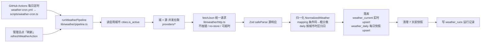
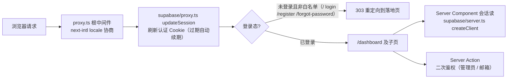

# WeatherMind 开发速览

面向开发人员的项目速览。先看「核心链路」流程图理解实现逻辑，再对照「代码地图」定位代码。

## 项目是什么

WeatherMind 是一个**多源天气仪表盘 + AI 当日预报**：

- 每天定时从 Open-Meteo / OpenWeatherMap / WeatherAPI.com 三个数据源采集天气，归一化后写入 Supabase；
- 前端按「城市 × 数据源」展示实时天气卡片与近 7 天历史；
- 核心功能 **ForecastAgent**：用「确定性多源加权集成 + AI 自然语言解读」生成当日预报，先算后讲、结果可复现。

技术栈：Next.js 16（App Router）+ React 19 + Tailwind 4 + shadcn/ui（@base-ui/react）+ pnpm + TS strict，仅浅色模式。
Supabase（认证 + Postgres + RLS）、TanStack Query/Form、Zod、next-intl（zh 默认无前缀，en 走 `/en`）、Vitest。

## 核心链路

### 1. 天气采集：数据从哪来

两个触发入口，共用同一管道 `runWeatherPipeline(trigger)`：

- **定时**：GitHub Actions 每日 15:00 UTC（JST 0 点）直跑 `scripts/weather-cron.ts`，不经部署环境；
- **手动**：预报页「刷新」按钮（仅管理员）→ `refreshWeatherAction`。



要点：

- **加源易**：每源实现一个 `ProviderAdapter`（`source` / `fetchCurrentAndForecast` / `fetchDailyHistory`），注册进 `providers` 数组即可；
- **失败隔离**：单格失败只记一格（missingKey / network / http / parse / noData / db），整轮继续、绝不抛错；终态 success / partial / failed 写入 `weather_runs`；
- **写入端**：service_role 客户端（`supabase/service.ts`）绕过 RLS；手动触发经管理员白名单（`lib/weather/admin.ts`）。

### 2. ForecastAgent：当日预报怎么生成

**定位：不是通用聊天 agent，而是「确定性计算引擎 + AI 解读器」的分工。** 天气数值一律由数学内核产出（可复现、可单测、可审计），AI 只把指标翻译成自然语言——且运行在一个**受限的只读 ReAct 循环**里：两个工具只能回读内核数据（绝不计算）、调用走 SSE 流式 + `temperature=0`、输出是纯 Markdown 文档。LLM 从根上无法编造数字。

**流式管道**（「写一次读多次」：首个用户点「预报当日」认领生成，其后任何人只读库；生成走 SSE 流式，用户能逐 token 看到推理过程与 Markdown 正文）：

```mermaid
flowchart LR
    U["用户点「预报当日」<br/>forecast-view.tsx → useForecastStream"] --> POST["POST /api/ai-agent/forecast<br/>route.ts 自鉴权 createClient + getUser"]
    POST --> ST["runForecastAgentStream<br/>lib/forecast-agent/stream/stream.ts"]
    ST --> R["readForecast<br/>城×日×语言"]
    R -->|"success / pending"| DUP["duplicate 事件<br/>直接返回，不重复生成"]
    R -->|"无"| CL["claimPending<br/>唯一键 城×日×语言"]
    R -->|"failed"| CD["冷却判定<br/>isWithinRetryCooldown<br/>失败后 5 分钟内禁重试"]
    CD -->|"冷却期"| CDERR["error: retry-cooldown"]
    CD -->|"已过冷却"| CL
    CL --> SI["buildSourceInputs<br/>各源快照（weather_daily + weather_current）"]
    CL --> SI["buildSourceInputs<br/>各源快照（weather_daily + weather_current）"]
    SI --> W["computeWeights<br/>先验 + 一致性 + 真值MAE（α/β/γ）"]
    W --> PRED["predict 确定性集成<br/>engine/ensemble.ts"]
    PRED --> P["buildForecastAgentMessages<br/>指标表 + ReAct 协议 + 分歧块"]
    P --> RL["runReActLoopStream ≤4 步<br/>工具 query_source / get_metric<br/>temperature=0 流式"]
    RL --> VAL["validateMarkdownDoc<br/>两段齐全 + 数值容差"]
    VAL -->|"过"| OK["settle success<br/>指标 + markdown_body + react_trace + token"]
    VAL -->|"拒"| ERR["落 failed + failed_at<br/>error 事件"]
```



**逐步拆解**（核心流式状态机见 `lib/forecast-agent/stream/stream.ts`，DB 原语见 `db/db.ts`）：

1. **读既有**（`readForecast`）——按 城×日×语言 查预测行：success/pending 直接返回 duplicate 事件，不重复生成；
2. **失败冷却**（`db/db.ts` `isWithinRetryCooldown`）——failed 行距失败时刻 <5 分钟时返回 `retry-cooldown`，防失败重试无限刷服务器（正常使用不限次数，已生成过的直接读库）；冷却过后转认领重试；
3. **认领 pending 行**（`claimPending`）——insert 命中唯一键 (city_id, day, locale)；`23505` 冲突说明已被他人认领，读回现有行；存量 failed 行转回 pending 并清 `failed_at`/`error_code` 重新生成；生成失败统一落库为 `failed` + `failed_at`（供冷却计时），不再删除；
4. **取当日各源快照**（`buildSourceInputs`）——高/低/降水/条件取 `weather_daily`，湿度/风取 `weather_current` 当日快照（缺则 null，集成自动跳过）；
5. **源数校验**——当日数据源 <2 视为无效，返回 `insufficient-data`，不给出确定性结论；
6. **权重合成**（`engine/weights.ts` `computeWeights`）——`先验 PRIOR + 近 6 天一致性分（留一法偏离度）+ 真值 MAE` 三层合成，按真值天数用 α/β/γ 过渡：<7 天几乎全依赖先验 + 一致性，≥30 天 MAE 主导；
7. **确定性集成**（`engine/ensemble.ts` `predict`，全部纯函数、可单测）——
   - 加权均值：高温 / 低温 / 降水 / 风 / 湿度；
   - 降水概率：报雨（日降水 ≥0.1mm）源的权重占比（0-100）；
   - 天气状况：加权多数投票（跳过条件缺失的源）；
   - 预测区间：均值 ± 1.28×加权标准差（≈80% 置信）；
   - 置信度：多数派权重占比（high ≥75% / medium ≥50% / low），不依赖历史真值；
   - 风险标记：阈值（高温 ≥35°C / 低温 ≤0°C / 强降水 ≥25mm / 风 ≥6 级 / 雷暴 / 降雪 / 温差 ≥10°C）+ 至少 2 源一致才标，防单源误报；
8. **拼提示词**（`agent/prompt.ts`）——见下「Prompt 工程」；
9. **流式 ReAct 循环**（`agent/react-stream.ts` `runReActLoopStream`，最多 4 步）——每步发起一次 `chatCompletionStream` 流式调用（`agent/chat-stream.ts`：SSE，provider 忽略 stream 时降级单帧 JSON；`temperature=0`、45s 超时）。模型请求工具则 `agent/react.ts` 执行并喂回观察结果继续循环（坏调用以错误观察喂回模型自纠错）；否则该步内容即终态 Markdown 文档，以 `delta` 事件逐段流出；
10. **信任边界校验**（`lib/schemas/forecast-agent.ts` `validateMarkdownDoc`）——全文流完后跑轻量文本校验（见下）；
11. **settle 落库**——success 写全部指标 + `markdown_body` + `react_trace` + token 用量；任一步失败统一落库为 `failed` + `failed_at`（失败冷却计时）并发出带内 `error` 事件；客户端中途断线（AbortSignal 中止）在 `finally` 删除 pending 行，保证当日 城×日×语言 永不被卡死。

**工具**（`agent/tools.ts`）——只读，模型查看指标表之外数据的唯一窗口；两者都只回读确定性内核算出的数据，AI 不引入任何新数值（参数用 JSON-schema + Zod 双校验）：

- `query_source(source)` — 返回某数据源的原始预报快照（高/低/降水/条件/湿度/风）；
- `get_metric(metricId)` — 返回某条平台指标的权威值（与指标表同口径）。

**源间分歧检测**（`engine/divergence.ts`）——对各源输入做纯函数判定：降水分歧（湿/干两组）、条件分歧（非空类别 >1 组）、温差分歧（高/低 spread ≥3°C）。有分歧时提示词注入「必须逐源 query_source 核对后再定稿」的强制指令，驱动分歧日真正产生工具步骤（工具成为承重墙）。

**Prompt 工程**（`agent/prompt.ts` `buildForecastAgentMessages`）——整份上下文（指标表 / 权重行 / ReAct 协议 / 分歧块 / 铁律）**按当前语言组装**，防止英文界面下模型被中文数据表带偏、顺着输出中文：

- **上下文** = 指标表（每行 `metricId（label）：value　※note`）+ 权重行 + 可查询源列表 + 分歧块；各源原始快照**不内联**——要看必须调 `query_source`；
- **输出契约**：只输出一份 Markdown 文档，含且仅含两个二级标题段、顺序固定——`## 推理过程`（en 为 `## Reasoning`）在前，`## 预报`（en 为 `## Forecast`）在后；预报正文用 2~3 句叙述（总览 + 行动建议），必须包含预测高温/低温（°C）与降水概率（%），但不逐条罗列指标表；
- **铁律**：数值只来自指标表（绝不编造/改口径）；有风险标记必须提及、无风险不得虚构或使用「高风险/预警」措辞；不质疑/贬低平台指标，只解释与建议。

**防幻觉兜底：Markdown 校验**（`validateMarkdownDoc`）——全文流完后做的机器校验，任一不过回滚该行并发出 `error: consistency`：

- 两段齐全且推理在前、预报在后；
- 预报段含与集成 high/low 差 ≤2.5°C 的温度值、PoP 差 ≤10 的百分比值（PoP=0 时「无降水」类措辞即可）；
- 防胡编：温度都在 −40~60°C 内、百分比 ≤100；
- 注意与旧结构化输出的反转：预报正文必须含温度数字，因此不再禁温度单位。

**为什么用受限 ReAct 循环而非单次调用**：预报数字是「事实」，必须保持可复现、可审计，故绝不要求模型计算——工具只用于让它核对源级事实（分歧日强制）。循环有上限（4 步、无网络/搜索工具），不会滑向开放式工具滥用。未来若要让 agent 自主查补充数据，可在 `buildTools` 注册更多工具——但当前内核已覆盖全部展示指标。

其他要点：

- **权重自校准**：真值由每日 cron 拉三源历史观测取中位数落 `weather_truth`（`engine/truth.ts` `backfillTruth`，只保留近 31 天），攒够天数后权重自动偏向 MAE 更小的源；
- **模型配置**：用户自带 OpenAI 兼容 baseUrl/key，按邮箱存 localStorage（`lib/model-config.ts`），服务端每次调用前做 SSRF 防护（仅 https + IPv4/IPv6 私网/保留段拦截 + DNS 复核，见 `agent/ssrf.ts` + `agent/dns.ts`）；
- **时区不变量**（迁移 `0011_city_timezone_check.sql`）：权重窗口 / 真值轮换均按 Asia/Tokyo 硬编码，故 `cities.timezone` 用 CHECK 约束为 `'Asia/Tokyo'`，防未来新增非东京城市破坏日期对齐；
- **流式 + 断线安全**：SSE 生成器透传客户端 AbortSignal；断线或未预期异常由 `finally` 兜底删除仍为 pending 的行，保证同一 城×日×语言 随时可重试。

### 3. 请求与认证：谁能看什么



- 写路径统一 service_role 绕过 RLS（`supabase/service.ts`，**仅服务端 import**）；读路径走 authenticated 角色 + RLS（0003_rls.sql）；
- 管理员门禁双保险：展示层隐藏按钮 + 动作层拒绝直调（`lib/weather/admin.ts`）；
- `/api` 路由不走 proxy 中间件，自行鉴权：`app/api/ai-agent/forecast` 用 `createClient` + `getUser` 自鉴权，并在流开始前服务端重新校验模型配置 schema（流开始前失败返回非 2xx JSON；流开始后错误走带内 SSE 事件）。

## 代码地图（路径 — 功能）

### 认证

- `proxy.ts` — 根中间件：locale 协商 + 会话刷新 + 路由守卫
- `supabase/proxy.ts` — `updateSession`：在响应上同步认证 Cookie、过期自动续期
- `supabase/server.ts` — `createClient`：服务端会话客户端（RSC / Server Action）
- `supabase/service.ts` — `createServiceClient`：service_role 客户端，绕过 RLS（服务端专用）
- `supabase/auth/actions.ts` — 登录 / 两段式注册 / 忘记密码 Server Action
- `supabase/auth/errors.ts` — `mapAuthError`：Supabase 错误 → 受限错误码
- `lib/schemas/auth.ts` — 认证表单 Zod schema

### 天气采集管道

- `lib/weather/pipeline.ts` — 主入口：`runWeatherPipeline`（采集）/ `runWeatherBackfill`（历史回填）；城×源并发、落库、清理、写运行记录，恒不抛错
- `lib/weather/http.ts` — `fetchJson` / `fetchStream`：唯一 fetch 封装（先判 `res.ok`、`cache:no-store`、可超时、绝不抛错；`fetchStream` 不读 body——调用方用 `response.body.getReader()` 消费 SSE，并设 `redirect:manual` 防 SSRF 跳转）
- `lib/weather/providers/index.ts` — `ProviderAdapter` 契约 + 三源注册表
- `lib/weather/providers/open-meteo.ts` — 免 key 源 adapter（naive 本地时间转 UTC）
- `lib/weather/providers/openweather.ts` — OpenWeatherMap adapter
- `lib/weather/providers/weatherapi.ts` — WeatherAPI.com adapter（km/h → m/s）
- `lib/weather/mapping.ts` — 各源条件码 → 8 个粗分类、单位换算
- `lib/weather/sse.ts` — SSE 帧解析纯函数（`splitSseEvents` / `extractDataPayloads` / `isDonePayload`），AI provider 流与前端 hook 共用
- `lib/weather/daily.ts` — 按城市时区归日、当日快照聚合、窗口工具
- `lib/weather/actions.ts` — `refreshWeatherAction` / `backfillWeatherAction`（管理员手动触发）
- `lib/weather/admin.ts` — 管理员白名单（`isAdminEmail`）
- `lib/weather/city-actions.ts` — 城市增删（管理员 + service 写入，FK cascade 清数据）
- `lib/weather/resolve-city.ts` — `?city=` 参数解析为唯一城市并补齐重定向
- `lib/weather/view-types.ts` — 展示层 DB 行类型断言（无生成的 Database 类型）
- `lib/weather/errors.ts` — 动作错误码类（WeatherError / CityError）

### 数据模型（前后端共享 Zod）

- `lib/schemas/weather.ts` — canonical `NormalizedWeather`（时间 UTC ISO、单位公制、条件码保留原值 + 粗分类）
- `lib/schemas/city.ts` — 城市表单 schema
- `lib/schemas/forecast-agent.ts` — 预测行类型、`METRICS` 指标 id 常量、chat 响应 schema、ReAct 轨迹 schema、Markdown 校验（`validateMarkdownDoc`）
- `lib/schemas/ai.ts` — 模型配置 schema、`/models` 响应 schema

### ForecastAgent

- `app/api/ai-agent/forecast/route.ts` — 流式端点：POST → SSE（`runForecastAgentStream`）；`createClient` + `getUser` 自鉴权，服务端重校验模型配置，透传客户端 AbortSignal
- `lib/forecast-agent/stream/stream.ts` — `runForecastAgentStream`：唯一生成入口（SSE 事件异步生成器）；读 → 认领 → 集成 → ReAct → 校验 → settle，失败回滚删 pending 行
- `lib/forecast-agent/db/db.ts` — 持久化原语：`readForecast` / `claimPending`（23505 读回；存量 failed 转 pending）/ `settleRow` / `buildSourceInputs`
- `lib/forecast-agent/engine/ensemble.ts` — 确定性集成：加权均值 / 降水概率 / 多数投票 / 区间 / 置信度 / 风险标记
- `lib/forecast-agent/engine/weights.ts` — 源权重：先验 + 一致性 + 真值 MAE 合成与 α/β/γ 过渡（窗口按 Asia/Tokyo 对齐）
- `lib/forecast-agent/engine/divergence.ts` — 源间分歧检测（降水 / 条件 / 温差），提示词强制 query_source 核对
- `lib/forecast-agent/engine/truth.ts` — 参考真值回填（三源历史中位数 → `weather_truth`，只留近 31 天）
- `lib/forecast-agent/agent/prompt.ts` + `prompt-text.ts` — 按语言组装提示词（指标表 / 权重行 / ReAct 协议 / 分歧块）+ 本地化模板
- `lib/forecast-agent/agent/react.ts` — ReAct 核心：类型、JSON 解析、usage 合并、工具执行（与流式共用）
- `lib/forecast-agent/agent/react-stream.ts` — 流式 ReAct 循环（≤4 步）：`delta` / `thought` / `rollback` / `tool` / `result` 事件
- `lib/forecast-agent/agent/chat-stream.ts` — OpenAI 兼容流式 chat（SSE，或单帧 JSON 降级）+ SSRF 防护
- `lib/forecast-agent/agent/chat.ts` — wire 消息/工具互转、请求体构建、`assertPublicBaseUrl` 前置（与 chat-stream 共用）
- `lib/forecast-agent/agent/tools.ts` — 只读工具注册表：`query_source` / `get_metric`（参数 JSON-schema + Zod 双校验）
- `lib/forecast-agent/agent/ssrf.ts` — SSRF host 白名单（仅 https、IPv4/IPv6 私网/保留段拦截、DNS 复核）
- `lib/forecast-agent/agent/dns.ts` — DNS 解析唯一入口（SSRF DNS 复核）
- `lib/forecast-agent/db/db.ts` — 预测行原语（读/认领/落库）+ 失败冷却 `isWithinRetryCooldown`（5 分钟）+ `RETRY_COOLDOWN_MS`
- `lib/forecast-agent/common/errors.ts` — `ForecastAgentErrorCode` 外部契约（no-model / retry-cooldown / insufficient-data / provider / parse / consistency / react-loop / generic）
- `lib/model-config.ts` — 模型配置 localStorage 读写（按邮箱隔离）+ 调 `/models` 列表

### 页面与组件

- `app/[locale]/dashboard/forecast/page.tsx` — 预报页 RSC：查单城当前天气 + 最近运行（不预载预报行——由客户端流式拉取）
- `components/dashboard/forecast/forecast-view.tsx` — 预报页客户端视图：城市切换 / 刷新 / 经 SSE 流触发 ForecastAgent
- `components/dashboard/forecast/forecast-agent-card.tsx` — 结果卡片：指标图标卡 + 流式 Markdown 正文（`## 推理过程` / `## 预报`）；旧结构化行兜底 summary/points/advice
- `components/dashboard/forecast/forecast-metrics-grid.tsx` — 9 张权威指标图标卡（高/低/降水概率/等级/状况/风/湿度/置信度/风险）
- `components/dashboard/forecast/forecast-reasoning-card.tsx` — ReAct 推理轨迹卡（思考 / 工具调用 / 观察），流式实时出现
- `components/ui-preset/forecast-card-shell.tsx` — 共用卡片外壳（色调 / 状态圆点 / 阶段指示）
- `components/ui-preset/markdown.tsx` — Markdown 渲染预设（react-markdown + remark-gfm），shadcn token 样式
- `hooks/use-forecast-stream.ts` — SSE 消费 hook（POST `/api/ai-agent/forecast`、切帧、`delta`→Markdown、`thought`/`tool`→轨迹步、`rollback` 回滚思考文字）
- `hooks/use-model-config.ts` / `hooks/use-element-height.ts` — 模型配置订阅 / 左卡高度观测
- `app/[locale]/dashboard/history/page.tsx` — 历史页 RSC：近 7 天每日快照
- `components/dashboard/history/history-view.tsx` — 历史表格 + 图表
- `app/[locale]/dashboard/cities/page.tsx` — 城市列表页；`components/dashboard/cities/*` — 列表 + 增删对话框
- `app/[locale]/dashboard/logs/page.tsx` — 采集日志页（管理员，`weather_runs` 最近 100 条）
- `app/[locale]/dashboard/settings/page.tsx` — 设置页；`components/dashboard/settings/model-config-card.tsx` — 模型配置表单
- `app/[locale]/dashboard/layout.tsx` — 仪表盘布局（侧边导航 + 登录守卫）
- `i18n/routing.ts` — next-intl 路由（zh 默认 / en）

### 定时任务与 CI

- `scripts/weather-cron.ts` — Actions 每日采集入口：跑管道 + 回填真值，全败退出非零标红
- `.github/workflows/weather-cron.yml` — 每日 15:00 UTC（JST 0 点）注入 secrets 跑采集
- `.github/workflows/ci.yml` — typecheck / lint / build + 覆盖率测试上报 Codecov
- `.github/workflows/stryker.yml` — PR 定向变异测试（只变异「有测试」的变更文件）

### 数据库（`supabase/migrations/`，按序执行）

- `0001_weather.sql` — cities / weather_current / weather_runs + 8 个日本城市种子
- `0002_weather_daily.sql` — 每日快照表（城×源×日唯一）
- `0003_rls.sql` — 启用 RLS：authenticated 只读
- `0004_remove_weather_forecast.sql` — 仅旧库：删除废弃的 weather_forecast 表
- `0005_email_registered.sql` — `is_email_registered` RPC（注册预检，service_role 可调）
- `0006_forecast_agent.sql` — 预测表（城×日唯一）+ 真值表
- `0007_forecast_agent_locale.sql` — 预测加 locale，唯一键改 城×日×语言
- `0008_forecast_agent_tokens.sql` — 预测加 token 用量列
- `0009_forecast_agent_react_trace.sql` — 预测加 `react_trace` jsonb（ReAct 思考/动作轨迹；一步直出时空数组）
- `0010_forecast_agent_markdown.sql` — 预测加 `markdown_body` text（纯 Markdown 输出全文；旧结构化行保持 null）
- `0011_city_timezone_check.sql` — `cities.timezone` CHECK = `'Asia/Tokyo'`（时区不变量：权重窗口 / 真值轮换均按东京硬编码）

## 快速开始

```bash
pnpm install
cp .env.example .env.local   # 填 Supabase 连接与数据源 key，见下
```

1. Supabase Dashboard → SQL Editor 按 0001 → … → 0011 顺序执行迁移；
2. `pnpm dev` 启动，注册账号进入仪表盘；在「设置」配置 OpenAI 兼容模型后即可生成 ForecastAgent 预报；
3. 校验：`pnpm typecheck` / `pnpm lint` / `pnpm test`（CI 见 `.github/workflows/ci.yml`）。

### 环境变量

| 变量 | 用途 |
| --- | --- |
| `NEXT_PUBLIC_SUPABASE_URL` / `NEXT_PUBLIC_SUPABASE_ANON_KEY` | Supabase 连接（公开，受 RLS） |
| `SUPABASE_SERVICE_ROLE_KEY` | service_role 服务端密钥，管道写入 / 城市增删用；**勿加 `NEXT_PUBLIC_`、勿在客户端 import** |
| `OPENWEATHER_API_KEY` | OpenWeatherMap 数据源（服务端） |
| `WEATHERAPI_API_KEY` | WeatherAPI.com 数据源（服务端） |

## 关键约定

- 错误模式：服务端动作 / 管道返回结果对象与受限错误码，**不抛错跨 RPC**；客户端 `!ok` 抛对应 Error 类驱动 toast
- Zod 只在信任边界（外部响应 / 表单 / 路由入参），`safeParse` 优先；内部可信数据不解析
- 网络请求统一走 `lib/weather/http.ts` `fetchJson`
- 写路径 service_role、读路径 authenticated + RLS；`supabase/service.ts` 仅服务端 import
- 文案进 `i18n/messages/{zh,en}.json`；URL 跳转用 `@/i18n/navigation` 的 `Link` / `useRouter`
- 逻辑代码配简体中文注释；提交用 Conventional Commits
